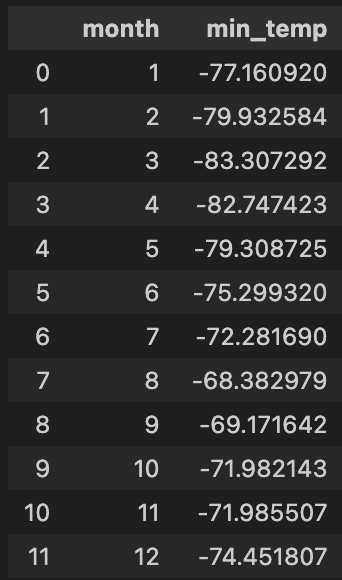
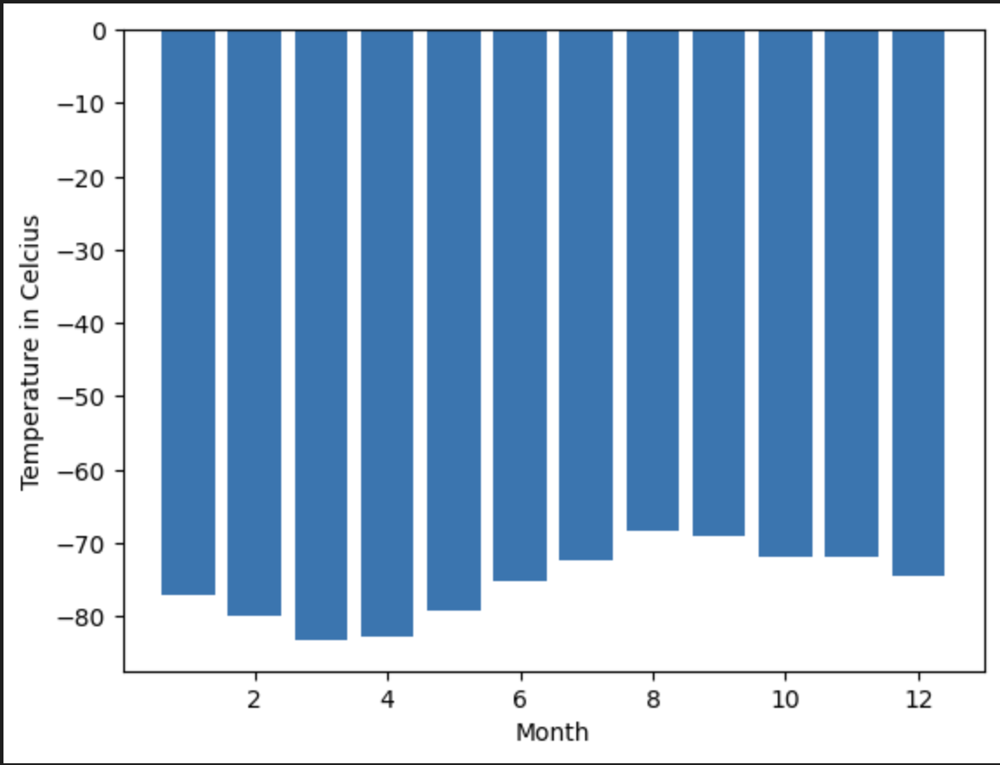
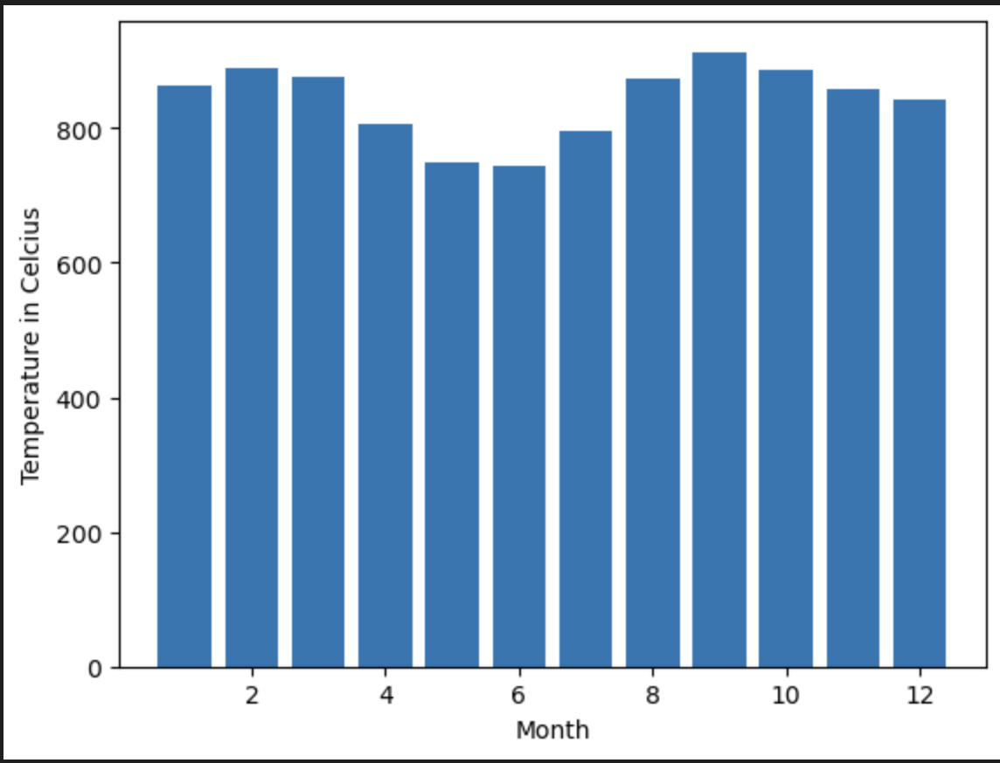
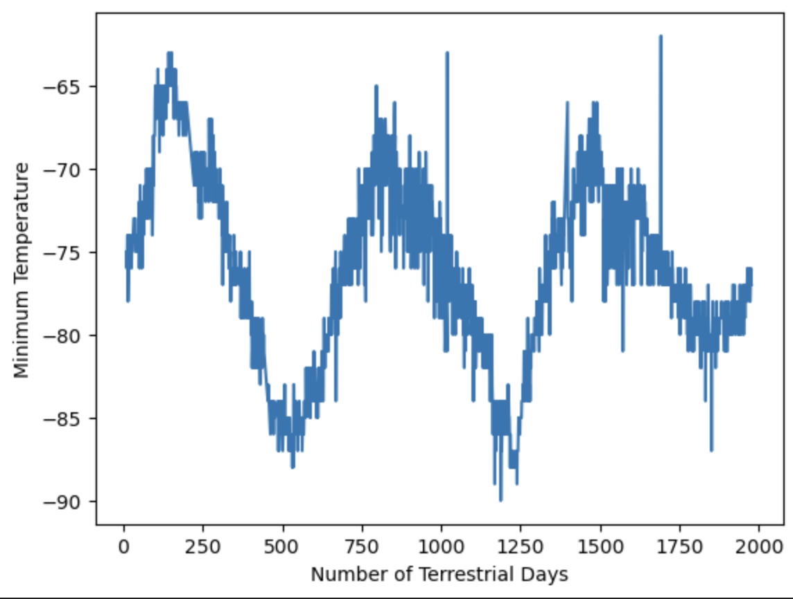

# mars-challenge
Mars Challenge related files are in the repository

## Solution
There are 2 parts to this challenge. Part 1 is the Mars News and the data is under the name part_1_mars_news.ipynd. Part 2 is the Mars Weather which is under the name part_2_mars_weather.ipynb.

## Task
Part 1: Scrape titles and preview text from Mars news articles. Optionally export the data into a JSON file.

Part 2: Scrape and analyse Mars weather data, which exists in a table.

###Analysis 
How many months exist on Mars?
There are 12 months on Mars.

How many Martian days' worth of data are there?
There is 1867 Martian days worth of data. 

What is the average low temperature by month?

Which month, on average, has the lowest temperature? The highest? 
The coldest month is Month 3 and the hottest month is Month 8.

Which month, on average, has the lowest atmospheric pressure? The highest? 
The month with the lowest atmospheric pressure is Month 6 and the month with the highest atmospheric pressure is Month 9 .

How many terrestrial days exist in a Martian year? A visual estimate within 25% was made. 

